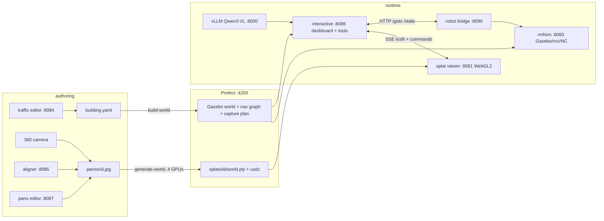

# Architecture

`dreamworld_gs` turns one 360° photograph per waypoint into a building you can
walk through, drive a simulated robot through, and hand to an AI agent — all on
one machine, fully offline. This document is the deep reference: every
technology in the stack, why it is there, the numbers it runs at, and the
questions each part tends to raise. The [README](README.md) is the operating
manual; this is the map of the machine.

Everything below describes the system as measured on its development box:
a multi-GPU NVIDIA workstation (six cards; one for the VLM, four for world
generation, one for the panorama editor's model), CUDA 12.8, ~600 GB of disk of
which ~550 GB is model weights.

---

## Contents

1. [The idea, in one diagram](#1-the-idea-in-one-diagram)
2. [Design tenets](#2-design-tenets)
3. [Service inventory](#3-service-inventory)
4. [The asset model](#4-the-asset-model)
5. [Coordinate systems and naming](#5-coordinate-systems-and-naming)
6. [Job orchestration — Prefect](#6-job-orchestration--prefect)
7. [World generation — HY-World](#7-world-generation--hy-world)
8. [Building simulation — RMF and Gazebo](#8-building-simulation--rmf-and-gazebo)
9. [The robot bridge](#9-the-robot-bridge)
10. [The splat viewer](#10-the-splat-viewer)
11. [Caching and preheat](#11-caching-and-preheat)
12. [The mid-corridor handover](#12-the-mid-corridor-handover)
13. [The interactive server and the truth protocol](#13-the-interactive-server-and-the-truth-protocol)
14. [The mission agent](#14-the-mission-agent)
15. [The agent harness and prompt design](#15-the-agent-harness-and-prompt-design)
16. [The panorama editor and aligner](#16-the-panorama-editor-and-aligner)
17. [Measured numbers](#17-measured-numbers)
18. [Deployment](#18-deployment)
19. [Taking it to a real building](#19-taking-it-to-a-real-building)
20. [Failure modes and their guards](#20-failure-modes-and-their-guards)

---

## 1. The idea, in one diagram

Two halves of one building meet at a nav graph. **RMF/Gazebo** simulates the
building from an annotated floorplan — doors, lifts, waypoints, lanes.
**Gaussian splatting** shows what the building actually looks like, one
generated world per waypoint, each grown from a single 360° photograph taken
standing there. A waypoint is a place you photograph; the lanes leaving it are
the ways you can walk out; and the graph's indices, names and metres are the
one vocabulary every service shares.



The one fact that makes the runtime half work: **the interactive server is the
single source of truth for where "the robot" is**, and both rollouts — the
splat camera and the Gazebo robot — follow it. Neither rollout is allowed to
be an independent authority. Every desync bug this project has had was a
violation of that rule, and every fix was restoring it (§20).

---

## 2. Design tenets

These are the rules that survived contact with the bugs, in roughly the order
they were learned:

- **One writer per fact.** The server is the only writer of position. In the
  viewer, `setHeading()` is the only writer of the camera heading, and
  `continuation()` is the only place a lane direction is ever negated. Every
  heading bug in the project's history was a second writer; fixes that removed
  a writer stuck, fixes that adjusted math did not.
- **One path per action.** A dashboard-driven walk *is* the panel's button
  press — the same `__rideWalk`, the same easing, the same arrival. When the
  agent had a parallel movement path of its own, every difference between the
  two paths was a place for a bug to live.
- **Marks beat any fit.** Two hand-placed positions in a splat world outrank
  any transform derived from bearings and alignments. Walks were always built
  mark-to-mark; lanes now take their direction from the marks too, because a
  lane that disagrees with its own walk aims one way and rides another.
- **Movers are not interrupted.** While a move is in flight, reconciliation
  (the watchdog, viewer position proposals) stands down. The mover owns the
  state until it lands.
- **Jobs vs services.** Anything measured in minutes goes on a queue that can
  be watched and retried (Prefect). Anything you talk to while looking at it
  is a service. The justfile only ever submits and follows.
- **Offline is a property, not a mode.** No container reaches the network at
  runtime: model weights are mounted read-only from `assets/`, every
  HuggingFace-adjacent process runs with `HF_HUB_OFFLINE=1`, and the input
  photographs never leave the box. `assets/` is gitignored, so the photographs
  cannot even be committed.
- **Data is addressed by place, not by name.** A panorama is named for the
  waypoint it was shot at; a splat inherits the name; the queue reads as a
  list of places. Nothing in the system is named after an adjective.

---

## 3. Service inventory

Twelve containers under one `docker compose`, plus one host process.

| service | image (size) | port | role |
| --- | --- | --- | --- |
| `prefect` | `prefecthq/prefect:3.8.1-python3.11` | 4200 | job queue, UI, retries, per-stage logs |
| `vlm` | `vllm/vllm-openai:v0.11.0` (Qwen3-VL-8B-Instruct) | 8000 (loopback) | camera-trajectory planning for generation; default mission-agent model |
| `viewer` | `dreamworld/splat-viewer` (62 MB) | 8081 | nginx serving the WebGL2 splat viewer + `assets/projects` as `/files/` |
| `panoviewer` | `dreamworld/pano-viewer` (62 MB) | 8082 | 360° viewer for the input panoramas |
| `rmfsim` | `dreamworld/rmf-tools` (6.1 GB) | 8083, 8090 | the building under RMF in Gazebo, screen published over noVNC |
| `editor` | `dreamworld/rmf-tools` (shared) | 8084 | traffic editor — author the map, over noVNC |
| `qwen` | `dreamworld/qwen-server` (6.9 GB) | 8088 | Qwen-Image-Edit-2509 behind an HTTP API (~45 GB VRAM, its own GPU) |
| `panoeditor` | `dreamworld/pano-editor` (239 MB) | 8087 | the panorama editor UI; crops, calls `qwen`, reprojects |
| `interactive` | `dreamworld/interactive` (270 MB) | 8086 | the tool surface, dashboard, mission agent, truth protocol (Flask, host networking) |
| `galaxea` | `dreamworld/rmf-tools` (shared) | — (via rmfsim) | the Galaxea R1 robot bridge; shares rmfsim's network **and IPC** namespaces |
| `worldjobs` | `dreamworld/rmf-tools` (shared) | — | Prefect worker for `build-world` (needs Gazebo, not CUDA) |
| `generator` | `dreamworld/splat-generator` (24.7 GB) | — | Prefect worker for `generate-world` (needs CUDA, 32 GB shm) |

Host process: the **panorama aligner** on :8085 (`just align`) — it rewrites
panorama files in place, so it runs where the files live rather than behind a
read-only mount.

GPU partitioning is by device id, not time-sharing: card 0 is the VLM's,
cards 1–4 (`DW_GPU_IDS`) are world generation's, card 5 (`DW_EDIT_GPU`) is the
image-edit model's. The justfile derives HY-World's rank count from
`DW_GPU_IDS` so torchrun's world size always matches what the container can
see.

**Q: Why is `interactive` on host networking?**
So the browser's `localhost:8086` and the viewer's `?agent=` URL are the same
server, and so it can reach the robot bridge on `localhost:8090` — which is
published by *rmfsim*, because the bridge shares rmfsim's network namespace
(§9).

**Q: Why do four services share one 6 GB image?**
`rmfsim`, `editor`, `galaxea` and `worldjobs` differ only by role — same RMF,
same Gazebo, same tools. One image means one build and no version skew between
the sim you watch and the worlds the queue builds.

**Q: What happens if the box reboots?**
Everything is `restart: unless-stopped`; Prefect state lives in
`assets/prefect`; splat caches live in the browser. The stack comes back by
itself; `just up` is only needed after a `docker compose down`.

---

## 4. The asset model

One project is one building is one directory — a single tree to copy, back up
or hand over:

```
assets/projects/<project>/
  maps/            <map>.building.yaml + floorplan images        (authored)
  worlds/<map>/    <map>.world, models/, nav_graphs/0.yaml,
                   capture_plan.json, sim.launch.xml             (generated)
  panos/<id>.jpg   one 360 per waypoint, named for it            (captured)
  panos/.aligned/  what rotation each alignment applied          (tool-written)
  panos/.before-edit/  originals of edited panoramas             (tool-written)
  splats/<id>/     world.ply, world.usdz, world.cam.json,
                   world.paths.json, gs_result/ …                (generated)
  splats/.aligned/<id>.json  the hand-placed neighbour marks     (tool-written)
  splats/scenes.json         the viewer's world index            (generated)
```

`world.paths.json` is the file that connects a splat to the building: the
waypoint's building-frame position (`at`), its up vector, the panorama origin,
the lanes leaving it (with bearing, metres, and a direction in *this world's*
frame), the hand-placed marks (`placed`), and one 240-point mark-to-mark walk
per marked corridor. It is rebuilt by `edge_walks.py` without any retraining —
data surgery (a mislabelled waypoint, a re-marked corridor) is a re-run of a
script, not a GPU job.

Sizes, for planning: the sample project is ~103 GB with all of HY-World's
intermediates; a bundle for another machine (`just bundle`) drops the 34 GB of
training intermediates and ships what the runtime reads. One `world.ply` is
tens of MB (the sample floor's sixteen worlds total ≈ 700 MB); a panorama is a
single JPEG.

**Q: Why keep generated files next to captured ones?**
Because the unit of ownership is the building. Handing a colleague "the HTX
project" must mean one tarball, not a scavenger hunt across four services'
data directories. Every container mounts this one tree.

**Q: What is authoritative if files disagree?**
The marks (`splats/.aligned/`) for anything inside a splat world; the nav
graph for anything in building metres; the panorama for what a place looks
like. Everything else is derived and can be regenerated from those three.

---

## 5. Coordinate systems and naming

There are exactly two coordinate systems, and one bridge between them:

- **Building metres** — the nav graph's frame. Waypoints, lanes, the robot's
  pose, the dashboard minimap, door positions. Shared by every service.
- **Each splat world's own frame** — HY-World output has metric-ish scale but
  arbitrary origin and orientation, *different for every world*. Nothing in
  one world's frame is comparable to another's. This is load-bearing: lane
  direction vectors do **not** transfer between worlds; only the neighbour's
  *name* does.

The bridge is the marks. A hand-placed mark says "waypoint `v7` is *here* in
`L11.v9`'s world", and its building position is known from the graph — so each
marked pair is one correspondence. Two marks make a walk; a set of marks makes
a least-squares similarity that puts the live camera on the minimap (§10); a
shared edge marked in two worlds makes the mid-corridor handover possible
(§12).

Naming: `<level>.<name>` for named waypoints (`L11.cafe`), `<level>.v<index>`
for unnamed ones (`L11.v7`), `<level>.<a>--<b>` for corridors (sorted
endpoints — an edge is one corridor, not two). The level is always part of the
id because names repeat across levels (`L1.lift_lobby` sits directly under
`L11.lift_lobby`).

**Q: Why not solve one global transform per splat and put everything in
building coordinates?**
It is planned (see the traversal plan) but not required for anything shipped:
walks, handovers and the minimap all work from pairwise correspondences, which
are exactly what the marks give. A global registration adds a failure mode
(a bad fit silently poisons everything downstream) where marks fail loudly and
locally — one corridor, one re-mark.

**Q: How wrong can a mark be before it shows?**
The measured tolerance in practice: marks placed by eye produce lane-vs-walk
agreement within a few degrees (the audit across 35 corridors showed 0.3–24°
of bearing slop but perfect walk consistency). The system's authority ordering
means a sloppy mark shifts where a walk *ends*, which you see and re-mark; it
cannot silently rotate a heading.

---

## 6. Job orchestration — Prefect

Prefect 3.8.1 runs the two expensive operations as named, retryable, logged
runs: `build-world` (minutes; Gazebo world + nav graph + capture plan from the
map) and `generate-world` (~20 minutes on four GPUs; one waypoint's splat from
one panorama). Two workers because the work needs different machines —
`worldjobs` has Gazebo and `rmf_building_map_tools`, `generator` has CUDA —
but both register with one server, so :4200 is one queue for everything.

One run produces one artifact and is named for it, so the queue reads as a
list of places. `build-world` publishes its nav graph as a Prefect artifact
table: levels, waypoints, lanes, which lanes cross a door.

**Q: Why an orchestrator at all, on a single box?**
Because a 20-minute GPU job belongs somewhere a closed laptop can't kill it,
somewhere with per-stage timing, logs, parameters and a retry button. The
justfile submits and follows; Ctrl-C stops following, never the job.

**Q: What does a full building cost?**
The sample floor has 27 waypoints. At ~20 minutes each on four GPUs,
serialized: ~9 hours of generation for one level, submitted as 27 independent
runs that can be inspected, retried and compared individually. `build-world`
adds minutes. Alignment and marking are human minutes per waypoint, not GPU
time.

---

## 7. World generation — HY-World

The generative core. From one aligned equirectangular photograph, HY-World
(HunyuanWorld) plus Wan2.1 produce a walkable 3D Gaussian splat world:

1. a navmesh is derived and a camera trajectory planned across it (the vLLM —
   Qwen3-VL-8B — captions and scores candidate views),
2. perspective views are rendered along the trajectory,
3. Wan2.1 (a 14B video diffusion model, FSDP-sharded across the four
   generation GPUs) expands them into temporally consistent video,
4. ~400 frames come out as posed views,
5. a 3D Gaussian splat is trained on them (2,000 steps, classic — not
   antialiased — rasterization so the PLY stays portable),
6. exports: `world.ply` (web viewer), `world.usdz` (Isaac Sim / NuRec),
   `world.cam.json`, held-out renders and metrics.

Typical outputs on the sample building: 355k–387k gaussians per world;
held-out PSNR 19–23 dB, SSIM 0.72–0.83, LPIPS 0.18–0.26 (`just summary` prints
the table).

The model inventory behind it — every weight the box holds, with its on-disk
size as fetched by `just setup` (the list itself is `scripts/models.txt`):

| model | disk | role |
| --- | --- | --- |
| `tencent/HY-World-2.0` | 163 GB | the core: HY-Pano 2.0 panorama synthesis + world generation |
| `Wan-AI/Wan2.1-I2V-14B-480P-Diffusers` | 84 GB | the 14 B image-to-video base, FSDP-sharded across the four generation GPUs |
| `hanshanxue/WorldStereo` | 64 GB | WorldStereo 2.0 — video expansion, built on Wan2.1 |
| `Qwen/Qwen-Image-Edit` | 54 GB | generation-side image editing inside the HY pipeline |
| `Qwen/Qwen-Image-Edit-2509` | 54 GB | the panorama editor's model (§16) — ~45 GB VRAM in bf16 |
| `Qwen/Qwen3-VL-8B-Instruct` | 17 GB | trajectory-planning VLM + default mission-agent model (§14) |
| SAM 3 (`facebook/sam3` + ModelScope image/video checkpoints) | 3.3 + 9.7 GB | segmentation — the HF repo is gated, so the checkpoints come from ModelScope |
| `tencent/HunyuanWorld-Mirror` | 4.8 GB | WorldMirror 2.0 |
| `laion/CLIP-ViT-H-14` | 3.7 GB | vision-language embedding used by the pipeline |
| `IDEA-Research/grounding-dino-tiny` | 1.3 GB | open-vocabulary detection for the trajectory planner |
| `Ruicheng/moge-2-vitl-normal` | 1.3 GB | monocular geometry / normals |
| `naver-iv/zim-anything-vitl` | 1.2 GB | matting |
| `facebook/dinov2-base` | 0.3 GB | visual features |

Roughly 460 GB of weights proper; with cache structure and residue the README's
~550 GB planning figure holds. Only three of these ever hold a GPU at rest —
the VLM (card 0), the editor's model (card 5, and only while the service is
up), and whatever `generate-world` loads across cards 1–4 for the duration of
a job. Everything else pages in per pipeline stage and releases with the job.

The number that matters more than any of those: **the metrics measure
self-consistency, not fidelity.** Every held-out view was itself generated
from the one photograph, so a world can score well and still have invented a
corridor. The side-by-side renders under `gs_result/renders/` and a human eye
are the fidelity check. This is the honest limit of single-photo generation.

**Q: Why one photo per waypoint instead of walking the corridors with a
camera?**
Capture cost. A building becomes photographable in an afternoon by one person
with a 360 camera and a list of waypoints. The corridors between worlds are
then *walks across worlds* (marks + handover) rather than captures of their
own. A planned extension captures edges in simulation first (panoramas only,
indistinguishable from human capture) to validate a denser pipeline before
anyone walks a building.

**Q: How real is the scale?**
Metric-ish. HY-World infers scale from monocular cues; across 62 bearings of
one sample world the implied units-per-metre ranged 0.65–2.95. This is exactly
why nothing downstream trusts a fitted scale and everything trusts two marks.

**Q: Why four GPUs, and can it be fewer?**
Wan2.1's FSDP sharding ships and is tested at world size 4; the justfile
derives rank count from `DW_GPU_IDS` but widening or narrowing is "not free"
(upstream's words). VRAM: ~60 GB class cards.

**Q: What was patched?**
Upstream fixes live in `docker/splat-generator/hyworld.patch`; environment
pinning in `build_env.sh`. SAM 3 weights come from ModelScope because the
HuggingFace repo is gated.

---

## 8. Building simulation — RMF and Gazebo

Open-RMF provides the building semantics — doors, lifts, levels, nav graphs —
and Gazebo simulates it. The **traffic editor** (:8084) authors
`<map>.building.yaml`; `build-world` compiles it into a Gazebo world plus
`nav_graphs/0.yaml`; **rmfsim** (:8083) runs it. Both editor and sim are Qt
applications with no headless mode, so each publishes its X screen over noVNC
— a browser tab is the display.

Isolation details that cost real debugging time and are now load-bearing:

- `GZ_PARTITION=dreamworld_rmf` — the generation pipeline boots its own
  Gazebo (`sim_world`) for rendering; two sims on one transport bus fight over
  `/clock` and the door plugins. Partitioning makes discovery opt-in.
- `GZ_IP=127.0.0.1` — transport binds loopback, which is only reachable by
  containers that deliberately share the namespace (the bridge).

**Q: Why RMF and not a plain occupancy map?**
Doors and lifts. RMF gives them as first-class, stateful things a mission must
negotiate (`open_door`, `call_lift`), which is what makes the agent's task
non-trivial — and the fixed eight-step `take_lift` template (§14) meaningful.

**Q: Is Gazebo doing physics for the splat half?**
No. The splat half never touches Gazebo. The robot bridge drives the Galaxea R1
by pose interpolation (below), and RMF handles door/lift state. Gazebo is the
visual, watchable embodiment plus the plugin host — deliberately cheap.

---

## 9. The robot bridge

`docker/rmf-tools/robot_bridge.py` (767 lines) spawns a Galaxea R1 into the
rmfsim Gazebo and serves it over HTTP on :8090: `/goto` (waypoint polyline),
`/turn`, `/door`, `/call_lift`, `/pick`, `/place`, `/state`, `/reset`, and a
live-settable `/facing` yaw-offset knob (currently 0 — kept as a knob because
it was once misdiagnosed as the source of a viewer bug, and a knob is cheaper
than the next misdiagnosis).

Motion is interpolated along the nav polyline at `DRIVE_SPEED` 2.0 m/s and
`TURN_RATE` 1.25 rad/s — the same two constants the interactive server hands
to the viewer, which is what keeps camera and robot edge-for-edge in step. RMF
publishes `/robot_state` at ~1.5 Hz, the hard ceiling on pose liveness; the
interactive server's pose pump polls the bridge at 4 Hz and streams the pose
to the dashboard, so the marker moves between waypoints.

Two container-namespace facts worth their comments:

- The bridge joins **rmfsim's network namespace** (`network_mode:
  "service:rmfsim"`), so it joins the Gazebo you can *see* instead of booting
  a second one nobody is looking at (the port :8090 is therefore published by
  rmfsim).
- It also joins **rmfsim's IPC namespace**. Fast DDS prefers shared memory
  between participants it believes are on one host; `/dev/shm` is
  per-container. Without `ipc: "service:rmfsim"` the bridge spawns and drives
  the robot but never receives a single `/robot_state` — publishing works,
  discovery does not.

**Q: `/goto` returns immediately — how does anyone know the robot arrived?**
Nobody trusts the dispatch. Mission verification measures the bridge's RMF
state against the target (within 0.8 m); the watchdog measures *stillness*
(position delta < 0.05 m across 5 s samples, two strikes, gap > 1.5 m) before
concluding a robot is stranded rather than merely slow. Both exist because
`/goto` returning early once teleported a robot backwards mid-corridor.

**Q: Can this drive a real robot?**
The surface is deliberately narrow — waypoint goto, doors, lifts, state — and
already mirrors what an RMF fleet adapter exposes. Pointing `GALAXEA_URL` at a
shim over a real fleet manager is the intended seam; the truth protocol and
watchdog rules were designed against a robot that is *slow and sometimes
silent*, which is what real hardware is.

---

## 10. The splat viewer

A single static page (nginx, 62 MB image): `main.js` (~3,600 lines) over
WebGL2, lineage antimatter15/splat, no build step, no framework. The renderer
draws instanced quads sorted back-to-front by a worker; splats arrive as
32-byte records (position 12 B, scale 12 B, RGBA 4 B, quaternion 4 B). Above
500k records it renders at device-pixel-ratio 1.

On top of the renderer sits the tour system: `tour.points` (a walk's
polyline), `tour.t` (0→1 progress), follow-mode axes derived per frame, and
the discipline that every heading decision goes through **one writer**,
`setHeading(worldDir, {from, ms, now})` — the swing animation lives inside it
and is callable from nowhere else. `continuation(doc, cameFrom)` is the only
place a lane direction is negated (arriving along an edge, keep travelling —
the lane back, reversed).

The edge panel is the operator surface: a 220×220 minimap of the waypoint's
plan walls and lanes (dashboard palette — filled dot marked, hollow ring
unmarked, green you-are-here), clickable vertices (16 px hit radius) that
press the same buttons the spot row has, a go-to selector, save/clear mark
buttons, and the cache line (§11).

The minimap also carries the **live camera wedge**. Riding, its position is
exact: `tour.t` of the lane being ridden, which stays true straight through a
mid-corridor handover. Flying by hand, the camera's world position is
projected through a closed-form 2D least-squares similarity (Procrustes)
fitted from the marks — each marked neighbour is a point known in both frames,
so a camera position in world coordinates was a building position all along.
The panel repaints at ~8 Hz and the repaint loop stops itself when the panel
is replaced.

Control handedness: a viewer opened with `?agent=` **connects to the
dashboard automatically** (which is also what makes a refresh land where the
dashboard says). Clicking a walkthrough button detaches first — taking the
controls by hand is what lets the agent go — while position *proposals* keep
flowing so the model still hears where hand-walks land. The chip is the
light and the switch.

**Q: Why no framework, no bundler, no TypeScript?**
The page is one file served by nginx and edited with a text editor; the
iteration loop is `docker compose build viewer` (seconds). Every abstraction
between the code and the canvas would have been in the way during the heading
saga, where the fix was invariably *removing* a moving part.

**Q: How does the viewer survive the server restarting?**
The SSE channel reconnects with backoff; a dashboard restart needs no viewer
reload. The one-viewer rule (server evicts older tabs, sends `bye`, closes
their stream) prevents the multi-tab fights that once looked like desyncs.

**Q: What does `?speed=` / `?handover=` do?**
`?speed=` sets hand-walk pace (m/s; 2.0 matches the robot, 0.5 is a marking
stroll). `?handover=` moves the world-trade point along a corridor (default
0.5; `1` restores swap-at-the-vertex, §12).

---

## 11. Caching and preheat

Three tiers stand between a click and a rendered world, each an order of
magnitude faster than the one below:

| tier | where | what | typical latency to usable |
| --- | --- | --- | --- |
| 1. bytes | Cache API store `dreamworld-splats-v1` | `world.ply` as fetched | seconds (parse still due) |
| 2. rows | same store, key `world.ply.rows` | the parsed 32 B/splat records (~⅓ the ply size, ~12 MB per world) | ~100 ms disk read |
| 3. memory | `unpacked` Map, capacity 32 worlds | records ready to post to the renderer | ~0 |

The **warm sweep** downloads the whole building breadth-first from wherever
you stand (bytes), then converts rows in the background — so each world is
parsed once per browser, ever. The **preheat** fills tier 3: neighbours of the
current waypoint first (they are the corridors a ride can take next), then
every other world, one at a time, yielding to any live move; ~500 MB of RAM
holds the sample floor. A 5-second watcher starts both no matter how the page
was opened — the per-site kickoffs once scheduled themselves before the
functions existed (they sit below an `await` in `main()`) and the counter sat
at 1/16 until the first move.

The unpacker worker has a single reply slot, so all unpacks are serialised
behind a promise queue — two in flight would hand the first caller the second
one's records. The rows cache makes the queue self-deduplicating: a ride whose
target is mid-preheat waits for that unpack, then reads the rows it just
stored.

The panel shows `splats cached 16/16 · preheated 16/16` with a **clear**
button that clears and nothing else (the watcher refills the store on its own;
clearing is for after a regeneration).

**Q: Why the browser's Cache API and not a service worker or IndexedDB?**
Cache API is the simplest persistent byte store with a Response-shaped API and
survives reloads without a SW lifecycle to manage. Caveat: it requires a
secure origin — `localhost` qualifies, a bare LAN IP does not; off a secure
origin the viewer falls back to counting in-session downloads and persistence
is the browser's ordinary HTTP cache.

**Q: What invalidates the cache?**
Nothing automatic — deliberately. Splats change only when regenerated, and the
person who regenerates clicks *clear*. `world.paths.json` (marks change often)
is always fetched `no-store` and never cached.

---

## 12. The mid-corridor handover

The signature interaction: walking a corridor, the world you are leaving and
the world you are entering trade places at the **midpoint**, under a
cross-fade, without the motion stopping.

Why it works — the geometry: both worlds hold the *same physical corridor*
between their own marks. Both walks are 240-point straight lines
(`np.linspace` mark to mark), so a fraction `t` along the edge means the same
place in either frame; and in follow mode yaw and pitch are measured *relative
to the path*, so they transfer across the frame change untouched. The swap is
therefore: post the far world's records, re-init the tour on its walk-back
reversed, restore `t`, yaw, pitch and pace. Nothing else moves.

Why the midpoint: each splat is sharpest near where its panorama was shot and
blurs with distance. At 50% you are exactly between the two panoramas — the
outgoing world at its worst, the incoming at its equal-best — and the whole
second half of the ride remains for the fade.

The fade is a genuine cross-fade on one WebGL canvas: the last drawn frame is
snapshotted into an overlay `<canvas>` (this requires
`preserveDrawingBuffer: true` on the GL context — without it the frame is
gone the moment it is composited), the new buffer sorts in underneath
(~220 ms hold covers the worker round-trip), then the snapshot dissolves over
450 ms. Because the two frames show the same aligned corridor, it reads as one
scene sharpening rather than a cut.

Free flight gets the same crossing: past 10% of a marked corridor (within
2.5 m laterally) the far world starts unpacking; past the handover fraction
the camera is re-expressed in the far frame — same distance along the edge,
same offset beside it, same height, heading mapped through the pair of edge
frames — and flying continues. Landing at ~20% from the new vertex is below
the 10% pickup on the way back, so the crossing cannot ping-pong.

Arrival bookkeeping (URL, panel, `/viewer/at` proposal, warm nudge) is shared
by all three ways a world can land — vertex step, ride handover, manual
crossing — in one `settle()` function, so they cannot drift apart.

**Q: What if the far side of the edge isn't marked?**
Rides quietly fall back to the old swap-at-the-vertex; free flight simply
doesn't cross. The handover needs the corridor marked from both ends, which
`just summary`'s walkable count already tracks.

**Q: Why not render both worlds and alpha-blend truly?**
One renderer, one sort, one buffer is a large part of why this viewer is fast
and simple. A frozen-frame cross-fade over aligned content is visually
indistinguishable from a true blend at these durations, for two orders of
magnitude less machinery.

---

## 13. The interactive server and the truth protocol

`docker/interactive/interactive.py` (Flask, ~2,600 lines) is the center of
the runtime: the tool surface, the dashboard (a single served page), the
mission agent host, and the **single source of truth** for position.

The protocol, end to end:

- **Truth pushes down, immediately.** Every state change calls
  `push_state()`, which sends the dashboard a state event and the viewer a
  `{"op":"truth", scene, level, yaw, facing, moving}` down the already-open
  SSE command channel (`/viewer/events`). Measured latency ~175–195 ms
  command-to-camera; a 6-second poll is backstop only, for a push missed
  during a reconnect.
- **Truth carries `moving`.** A walk publishes truth at every vertex it
  passes; `moving: true` (the MOVE lock's state) tells the viewer these are
  progress reports, not instructions to jump. Reconciliation is for idle.
- **The viewer proposes, never dictates.** Hand-walks and crossings POST
  `/viewer/at`; the server follows *when idle* (placing the robot at the
  vertex), answers `already there`, refuses scenes that don't exist — and
  while a move is in flight it accepts quietly and changes nothing, because
  the mover owns the state.
- **All movement serialises** through one lock (`MOVERS` = go_to, face, turn,
  take_lift): queued, not refused, with the wait logged.
- **One viewer drives.** A new `/viewer/events` connection evicts older tabs:
  they get `{"op":"bye"}`, their stream closes, and they do not reconnect.
- **A watchdog holds the robot to the truth** — but only when nothing else
  is moving: it skips while MOVE is held *or any mission todo is
  in_progress*, because MOVE covers one tool call and a mission is many tool
  calls with the agent thinking in between. It corrects only a robot that is
  *still* (< 0.05 m over 5 s), twice running, and > 1.5 m from where the model
  says it stands.
- **Commands block until the world moved.** `viewer_call("walk", ...)`
  resolves on `/viewer/done` (timeout 180 s per leg); `go_to` walks one edge
  at a time on both rollouts, started together with the same arc and distance
  (computed once, from the graph), so any divergence is bounded by one
  corridor and corrected at every vertex.

The dashboard itself: mission bar with run/pause/cancel (cancel clears the
mission, subtasks and input to empty — server-side too), the level minimap
(nav graph over the floorplan, affine-fitted through the waypoints both
name), arrow pad, tool palette, live log, the agent's world model, and a
live robot marker fed by the 4 Hz pose pump (a green triangle that keeps its
last heading when a pose arrives without one).

**Q: Why SSE and not WebSockets?**
One direction of push is all that's needed (commands and truth flow down;
reports flow back as plain POSTs), SSE reconnects natively, works through
every proxy, and is debuggable with `curl`. There is nothing here a socket
would add except states to manage.

**Q: What happens when the viewer and robot genuinely disagree?**
The server's answer wins, by construction: viewer proposals are refused or
deferred, robots are re-placed. Both followers re-read truth after any
refusal. Disagreement is designed to be a transient, not a negotiation.

---

## 14. The mission agent

`POST /agent` runs a deepagents/LangGraph agent over the same tool surface a
human drives, against **any OpenAI-compatible endpoint**: by default the
stack's own vLLM (Qwen3-VL-8B-Instruct, `--enable-auto-tool-choice
--tool-call-parser=hermes` — both required before tool calls work), or a
Claude model through a proxy by setting `DW_VLM_URL` / `DW_VLM_MODEL` /
`DW_VLM_KEY` — configuration, not code.

The harness owns correctness, not the model:

- `write_todos` rejects any step that is not exactly one tool call;
- a call out of turn is rejected as `out_of_order`;
- a subtask completes only when its **verify** passes — the viewer reporting
  where it stands *and* the bridge's RMF state putting the robot within
  0.8 m — so an agent cannot mark its own work done;
- `take_lift` installs a fixed eight-step template (select → face → call →
  open → enter → call target level → open → exit to the lobby *resolved on
  the target level*); calling `select_lift`/`call_lift` outside a template is
  hard-rejected, so a level change cannot be improvised;
- teleport exists for the operator (`just teleport`, dashboard double-click)
  and is deliberately absent from `/tools`.

**Q: How capable a model does this need?**
The harness was built so that a small local VLM (8B) can execute missions:
the tools are narrow, the todos are validated, and verification is external.
A stronger model plans better routes and recovers better from refusals
(`blocked by door` → open it); it cannot cheat more.

**Q: What does the agent actually see?**
The world model panel on the dashboard is exactly its context: position,
level, neighbours, doors, inventory, mission, todos, and tool results. No
screenshots, no renders — the splat viewer is for humans; the agent reads
state. §15 documents that context and the harness around it in full.

---

## 15. The agent harness and prompt design

The mission agent is deliberately a *driver of the tool surface, not a part
of it* — every tool stays directly callable without it, and the harness, not
the model, owns correctness. This section documents how, because the design
is mostly prompt engineering in the broad sense: what the model is told, what
it is shown, and what every refusal teaches it.

The default model, as served:

| quantity | value |
| --- | --- |
| model | Qwen/Qwen3-VL-8B-Instruct (8 B), 17 GB on disk |
| server | vLLM v0.11.0, OpenAI-compatible, loopback :8000 |
| placement | GPU 0, `--gpu-memory-utilization 0.80` |
| context window | `--max-model-len 32768` |
| tool calling | `--enable-auto-tool-choice --tool-call-parser=hermes` — without both, the first tool call fails with a 400 |
| cold start | ~17 GB weight load; the compose healthcheck allows 15 minutes |
| client settings | streaming, 120 s timeout, one retry, `recursion_limit` 300 |
| swap | `DW_VLM_URL` / `DW_VLM_MODEL` / `DW_VLM_KEY` → any OpenAI-compatible endpoint, no rebuild |

The same server doubles as the generation pipeline's trajectory planner
(captioning and scoring candidate views), which never calls tools — the two
flags exist purely for the agent.

### The gate pipeline

Every tool handed to the agent is wrapped by one decorator, `_gate`, so a
single pipeline sits between the model and the world:

```
model emits a tool call
  → _RUN.wait()            blocks while the operator has pressed pause
  → _CANCEL check          cancelled? return "stop, do nothing further"
  → _mission_gate(name)    is this the subtask due now? (else out_of_order)
  → the tool itself        the same function the dashboard buttons call
  → _record_verify(...)    check the world, advance the plan, log ✓/✗
  → append recent_log(12)  the last twelve log lines ride back in the result
```

`functools.wraps` preserves each tool's real signature, which is what
LangChain infers the argument schema from — the schemas the model sees are
the functions' own, never a hand-maintained copy that could drift.

### The system prompt

`AGENT_PROMPT` is short (~350 words) and every line is there because a model
did the wrong thing without it. Its load-bearing choices:

- **Identity grounds the two rollouts:** *"The building is real: you see it
  as gaussian-splat worlds photographed at each waypoint, and a Galaxea R1
  robot walks the same route in a Gazebo simulation of it."* One sentence,
  and the model stops treating viewer and robot as separate things to manage.
- **A three-way tool taxonomy:** CONTROL tools act (one action each), report
  tools look (*"looking is free"* — never gated), tracking tools plan. The
  prompt names every member of each set.
- **Negative space is stated:** *"There is NO 'forward' — ALL movement is a
  go_to."* Models reliably invent a forward primitive if the prompt doesn't
  close the door.
- **Anti-probing:** *"Do NOT probe for obstacles by trying a go_to and
  waiting for BLOCKED — that wastes a turn. Call plan_route FIRST"* — which
  returns an obstacle-aware step list that already opens every closed door,
  ready to feed into `write_todos`. The expensive failure mode (trial-and-
  error navigation) is converted into a one-call planning idiom.
- **The harness owns statuses:** *"You do NOT set statuses — the HARNESS owns
  them."* The model is told the rules of the cage it is in, which measurably
  reduces fighting it.
- **The retry protocol is spelled out:** on a ✗ verify the subtask stays
  in_progress; *"re-check with 'where' and retry that same call."*
- **Termination discipline:** *"Do not end while any subtask is unfinished.
  Keep replies short."*

### Errors are prompts

The harness's refusals are written as corrective instructions, because a
refusal is precisely the text the model reads next:

- out-of-order: *"the subtask due now is 'go_to v13' — call go_to, not
  open_door"* — names the exact call that will succeed.
- improvised lift call: the refusal restates the whole doctrine — *"level
  changes MUST go through take_lift ... it installs the correct verified
  sequence (select_lift → face → call_lift → open_door → go_to cabin →
  call_lift → open_door → go_to lobby), then execute those in order."* A
  model that never read the README learns the lift protocol from the error
  message alone.
- cancelled: *"mission cancelled by the operator — stop, do nothing
  further"* — an instruction, not a status code.

### The world model

`build_context()` renders one Markdown document — the same text, verbatim,
goes to the model and to the dashboard's world-model pane, so **the human
always sees exactly what the agent reads**. Prompt debugging becomes
observational: if the agent is confused, the pane shows the confusion.

```
## Mission            the goal, or (none)
## Subtasks           ✓ / ▶ / ○ per step, each with its last verify note
## Robot              at, level, facing, neighbours, doors open,
                      splat world on screen, gazebo pose (x, y, level)
## Interactable here  items at this waypoint (use `pick <item>`)
## Robot inventory
## Lifts              "(these are LIFTS; 'lift1' is a lift, its floor is a
                      LEVEL like L1)" — a disambiguation an 8B model needs
## Recent log         the last 12 events
```

Freshness works in two stages: the full world model is injected once per
mission (*"New mission from the operator: … Current world model: … Set the
mission and subtasks, then execute them."*), and per-step state arrives
through the tool results — every control-tool result carries `recent_log`
(the last twelve dashboard log lines) plus the verify outcome, which is
enough for the model to track a changing world without re-reading everything
each turn.

### Verification, per tool

Verifiers are registered with a decorator (`@verifies("go_to")` …) and run
against the *world*, never the tool's own claim:

| tool | verified against |
| --- | --- |
| `go_to` | model position at target **and** the bridge's RMF state within 0.8 m |
| `open_door` / `close_door` | the bridge's door state — "the bridge owns the real door; ask it rather than trusting our own record" |
| `pick` / `place` | the inventory actually contains / lacks the item |
| `face` / `turn` | the turn result and resulting facing |
| `select_lift` / `call_lift` | the lift subsystem's answer |

A pass auto-completes the subtask and promotes the next to in_progress; a
fail pins it in_progress with the note attached — visible to the model in its
next result and to the human in the subtask pane (`↳ verify ✗ robot is 2.3 m
from v13`).

### Plumbing

deepagents' `create_deep_agent` over LangGraph with a `MemorySaver`
checkpointer, one thread id (`"interactive"`) so conversation state persists
across missions within a server run; `recursion_limit` 300 (a mission is many
tool calls); `ChatOpenAI` streaming with a 120 s timeout and one retry. The
mission runs in a thread so `/pause`, `/resume` and `/cancel` answer while it
walks — pause blocks the *next tool call* (the current motion completes;
nothing is interrupted mid-corridor, per the movers-are-not-interrupted rule).

### Prompt design elsewhere in the stack

- **Tool descriptions are prompts.** `go_to`'s registered description teaches
  its contract — walks only fully-unblocked paths, names the clear waypoint
  and the obstacle when refused — so the schema the model sees carries the
  doctrine even before the system prompt does.
- **The panorama editor wraps the user's instruction server-side:** the model
  (Qwen-Image-Edit-2509) is told to hold the camera viewpoint, walls, floor,
  ceiling, windows and lighting exactly as they are and change only what was
  asked — so the operator types the *change* ("add a potted plant in the
  corner"), never a description of the room. The invariants live in one place
  on the server rather than in every user's phrasing.
- **The generation VLM plans trajectories** (captioning and scoring candidate
  views over the navmesh); it never calls tools, which is why the two vLLM
  tool flags (`--enable-auto-tool-choice --tool-call-parser=hermes`) matter
  only to the mission agent.

**Q: Why does the harness own subtask status instead of the model?**
Because self-reported completion is the single largest failure mode of tool
agents. Here a subtask *cannot* complete without the world agreeing — an
agent that hallucinates an arrival is contradicted by its own next context.

**Q: Why inject the world model once per mission rather than every turn?**
Token economy on an 8B model with a 32k window, and it turned out to be
sufficient: the per-result `recent_log` plus verify notes carry the deltas,
and `where` exists for a full re-read on demand (the prompt tells the model
to use it after a ✗).

**Q: What breaks first with a weaker model?**
Plan quality — routes that ignore a closed door until `plan_route` is
forced on it — and reply discipline. What does not break: order, statuses,
lift protocol, termination on cancel. Those are the harness's, by
construction.

**Q: How would this handle a bigger model?**
Unchanged — `DW_VLM_URL`/`DW_VLM_MODEL` point anywhere OpenAI-compatible. A
stronger model plans better and recovers faster from refusals; the gates cost
it nothing because a correct agent never hits them.

---

## 16. The panorama editor and aligner

Two tools own the input photographs.

**The aligner** (:8085, host process): a 360 records no heading, so every
panorama arrives rotated by however the photographer stood. Pick a waypoint,
pick a corridor, rotate until you look down it, save — the file itself is
rewritten so everything downstream loads it already facing the building.
`panos/.aligned/` records what was applied. Align **before** generating: the
world inherits the panorama's rotation, and the only fix afterwards is
regeneration. (One sample world was generated under a mislabelled waypoint;
its bearing-derived lane directions were up to 148° wrong, which is the bug
that taught the "marks beat any fit" rule.)

**The editor** (:8087 + the `qwen` model server): edits what a place looks
like *before* its world is generated. Face a view in the 360, type a change
("add a potted plant in the corner"), and the edit runs a five-stage
geometry-aware pipeline:

1. **crop** — the rectilinear view you are facing is extracted from the
   equirect (same camera basis as the WebGL viewer), so the model sees an
   undistorted photograph of a room, never a warped band of one. Crop is
   1024 px wide, height from the view's aspect (clamped 0.4–1.4, ×16-aligned;
   ≈ 1024×672 by default), FOV clamped 0.5–2.3 rad (≈29°–132°).
2. **edit** — the crop goes to **Qwen-Image-Edit-2509** (20 B parameters,
   Apache-2.0, `QwenImageEditPlusPipeline`, bf16 full precision): 40
   denoising steps, `true_cfg_scale` 4.0, seed defaulting to the vertex id so
   re-runs are reproducible. The instruction is wrapped server-side — *"Edit
   it in place … keep the walls, floor, ceiling, windows, camera viewpoint
   and lighting exactly as shown, changing only what this instruction
   describes"* — so the operator types the change, never a room description.
3. **reproject** — the edited crop is sampled back onto every in-frustum
   equirect pixel.
4. **diff-composite** — only pixels the model actually changed survive:
   per-pixel diff > 22/255, grown (max-filter 7) and feathered (blur 4),
   multiplied by a coverage mask that fades toward the frustum edge (so a
   heavily-redrawn view can't paste a hard seam). If the mask is empty the
   edit is rejected with *"no change — try rephrasing, or zoom so the target
   fills the view"* rather than silently saving a no-op.
5. **stack / revert / save** — edits accumulate on a candidate with a
   per-vertex undo history (`panos/.candidates/`); Save keeps the replaced
   photograph under `panos/.before-edit/`, writes in the original file's own
   extension (JPEG quality 95), leaves the alignment record alone (an edit
   does not *turn* the panorama), and answers with the exact command that
   propagates it: `just generate <id>`.

Whole-panorama edits (no facing given) use the same wrap plus an automatic
diff-composite, and run the model **twice** — once normally and once rolled by
half the width, cosine-blended across a 5%-width band — so the 360 seam stays
invisible. A brushed-mask mode composites only the painted region (feathered,
blur 8).

The model server is a deliberately separate service (FastAPI/uvicorn) that
scales horizontally: `QWEN_URLS` is a comma-separated fleet, one server per
GPU. It also accepts up to three attention-conditioned inputs — base,
depth-derived geometry wireframe, style-reference collage — with references
deliberately entering at half resolution (a quarter of the tokens), because
full-size references dominate attention and the model reproduces them instead
of editing (observed: restyle chains collapsing into near-copies of their
anchor). This repo's photograph-editing path uses only the base slot; the
other two exist for the sim-panorama restyle heritage and future use.

Numbers and deployment facts:

| quantity | value |
| --- | --- |
| model / license / precision | Qwen-Image-Edit-2509, 20 B, Apache-2.0, bf16 |
| disk / VRAM / placement | 54 GB on disk; ~45 GB VRAM — one whole card (`DW_EDIT_GPU`, default 5), H100/H200 class |
| server image / cold start | 6.9 GB image; first request waits on the weight load (`/health` says `loading`) |
| working resolution | 1536×768 equirect; crops 1024×~672 |
| source panoramas | 7680×3840 (~2.6 MB JPEG) from the 360 camera |
| inference | 40 steps per edit; ×2 for seam-blended whole-pano edits |
| HTTP envelope | 30-minute timeout per edit call — the design ceiling, not the typical case |
| scaling | `QWEN_URLS=http://a:8000,http://b:8000` — a parallel fleet, one card each |
| offline | weights from the mounted HF cache, `HF_HUB_OFFLINE=1`, no runtime network |

**Q: Why edit the panorama instead of the splat?**
The panorama is the single source everything is generated from. Editing the
splat would be editing one derivative; the next regeneration would silently
undo it.

**Q: Does editing cost resolution?**
Yes, and it is the main caveat: the editor works — and saves — at 1536×768,
a 5× downsample of the 7680×3840 camera originals. The original survives
under `.before-edit/`, but a waypoint regenerated after an edit is generated
from the working-resolution panorama. For cosmetic edits (removing a person,
a whiteboard) this has been acceptable; for a waypoint whose world quality
matters most, weigh the edit against reshooting the panorama.

**Q: Can the stack run without the edit model?**
Yes — `qwen` holds ~45 GB while loaded and is idle most of the time. On a
GPU-tight deployment, leave the service down until an editing session; only
:8087's edit button needs it, and everything else (viewing, generation,
missions) is unaffected.

**Q: Why 40 steps and guidance 4.0?**
The upstream defaults for the pipeline, kept because the failure mode that
matters here is *drift* (the untouched parts of the photograph changing), and
that is controlled by the diff-composite rather than by sampling parameters —
regions the instruction didn't touch stay pixel-identical to the original by
construction.

---

## 17. Measured numbers

Numbers observed on this deployment (sample project `multilevel_office`,
level L11, 27 waypoints, 16 worlds built at time of writing):

| quantity | value |
| --- | --- |
| truth push, state change → camera reacting | ~175–195 ms |
| poll backstop when a push is missed | 6 s |
| pose pump (bridge → dashboard marker) | 4 Hz |
| RMF `/robot_state` publish rate (pose liveness ceiling) | ~1.5 Hz |
| robot / camera drive speed (shared) | 2.0 m/s (`DW_DRIVE_SPEED`) |
| robot / camera turn rate (shared) | 1.25 rad/s (`DW_TURN_RATE`) |
| per-leg viewer timeout | 180 s |
| arrival verification tolerance | 0.8 m |
| watchdog: stillness / strikes / gap | < 0.05 m over 5 s / 2 / > 1.5 m |
| splat size | 355k–387k gaussians per world |
| `world.ply` / rows / records in RAM | ~tens of MB / ~12 MB / ~12 MB per world |
| whole sample floor: bytes / RAM preheat | ≈ 700 MB / ≈ 500 MB |
| rows read (tier 2 hit) | ~100 ms |
| full PLY parse (tier 2 miss, off-thread) | seconds, once per world per browser |
| handover point / fade | 50% of the corridor / 220 ms hold + 450 ms dissolve |
| held-out quality (self-consistency) | PSNR 19–23, SSIM 0.72–0.83, LPIPS 0.18–0.26 |
| generation time / training steps | ~20 min on 4 GPUs / 2,000 steps per world |
| model weights on disk | ~550 GB (`just setup`) |
| one project, with / without intermediates | ~103 GB / ~69 GB bundled |
| VLM | Qwen3-VL-8B-Instruct, ctx 32,768, GPU 0 at 0.80 util |
| image-edit model | Qwen-Image-Edit-2509, ~45 GB VRAM, its own GPU |

---

## 18. Deployment

**Hardware.** NVIDIA GPUs with CUDA 12.8 and the NVIDIA container runtime.
Generation wants four ~60 GB-class cards; the VLM takes one more (~17 GB
loaded); the image editor another (~45 GB). Runtime-only deployments (viewing
and driving a building that is already generated) need **no GPU at all** for
the viewer and dashboard — the WebGL rendering happens in the client browser —
and only whatever runs Gazebo if the robot half is wanted.

**Disk.** ~600 GB: 550 GB of weights, ~35–100 GB per building depending on
intermediates. **Software.** docker compose, `just`, `uv`; everything else is
in images.

**Offline posture.** `just setup` is the only step that touches the network.
At runtime no container makes an external request: weights are mounted
read-only, `HF_HUB_OFFLINE=1` everywhere relevant, and the viewer's CSP is
its own origin. The input panoramas are photographs of a real workplace and
by design never leave the machine; `assets/` is gitignored so they cannot be
committed either. This is the posture for air-gapped or
sensitive-environment deployment: burn the weights once, carry the box.

**Access.** Everything binds localhost; remote use is an SSH tunnel
(the README has the one-liner). Open splats in a real browser tab — embedded
IDE browsers abort large downloads. The Cache API needs a secure origin, so
tunnel to `localhost` rather than browsing to a LAN IP if you want the
persistent splat cache.

**Moving a building.** `just bundle` → one tarball (map, world, panoramas,
splats minus training intermediates) → `just unbundle` on the far side, which
lands files exactly where the stack looks. Weights come from `just setup`
there.

**Running halves.** `GALAXEA_URL` unset runs the viewer half with no Gazebo —
the whole visual system on a laptop. The mission agent's model is a URL —
point it at any OpenAI-compatible endpoint.

**Updating the viewer.** `main.js` is baked into its image: `docker compose
build viewer && docker compose up -d viewer`, then a hard refresh.

---

## 19. Taking it to a real building

The capture procedure, per building:

1. Author the map in the traffic editor (or import CAD → trace): levels,
   walls, waypoints, lanes, doors, lifts. `just world`.
2. Walk the building once with a 360 camera and the capture plan: one
   photograph standing at each waypoint. Name files for the waypoint ids.
3. `just align` — turn each panorama to face the building. Minutes per
   waypoint, by eye, once.
4. Optionally `:8087` — edit out what shouldn't be there (a person, a
   whiteboard) *before* generating.
5. `just generate <id>` per waypoint — the queue at :4200 shows progress;
   ~20 min each on four GPUs.
6. In the viewer, mark each corridor's far end from both sides (two marks =
   a walk; both sides = a smooth handover). `just summary` tracks
   walkability.

What to expect in the real world:

- **Fidelity is bounded by the single photograph.** Everything out of view of
  the vantage point is invented. Shoot from junction centres, not against
  walls; expect texture-poor corridors (bare drywall) to generate blander
  worlds than cluttered ones.
- **People in panoramas** are baked into the world. Either photograph
  off-hours or edit them out at :8087 before generating — the pipeline keeps
  originals under `.before-edit/`.
- **Repetitive floors** (tiled linoleum) are a known SfM/generation risk; the
  honest fix is capture-side (angle, coverage), not pipeline hints.
- **The self-consistency trap:** a well-scoring world can still have invented
  a corridor. Budget a human walkthrough of every generated world against the
  side-by-side renders before trusting it operationally.
- **Scale of effort** for a 27-waypoint floor: one afternoon of capture, one
  hour of aligning and marking, one night of GPU. The marginal cost of the
  next building is capture + GPU time only.

---

## 20. Failure modes and their guards

The system's guards were each paid for by a specific bug. The short registry,
as institutional memory:

| failure | guard |
| --- | --- |
| Two components each writing camera yaw with their own sign convention | single-writer `setHeading()`; `continuation()` owns the only negation |
| Lane direction (bearing-derived) disagreeing with its own walk (marks) — 148° on one edge | `edge_walks.py`: marks beat bearings whenever both ends are marked; audit script checks `dot(travel, lane.dir) > 0` for every walk |
| Agent movement path diverging from the hand path | one path: dashboard legs press the panel's button (`__rideWalk`) |
| Watchdog teleporting the robot mid-mission (MOVE only covers one tool call) | watchdog also stands down while any todo is `in_progress` |
| `/viewer/at` teleporting the robot mid-corridor; hand-walks yanking the model off a live route | while MOVE is held, proposals are accepted quietly and change nothing |
| Multiple viewer tabs fighting over the camera | one-viewer rule: eviction + `bye` + stream close + no auto-reconnect for the evicted |
| In-flight truth arriving after the viewer's own move, walking it back | `moving` flag on truth; 5 s `__lastAt` guard on stale truth |
| A same-scene truth push turning the camera at a dead end | same-scene truth returns without touching the heading; arrival owns it |
| `/goto` returning on dispatch read as arrival | stillness-measured watchdog; RMF-state verification at 0.8 m |
| Two PLY unpacks in flight sharing one worker reply slot | serialised unpack queue; rows cache makes it self-deduplicating |
| Prefetch kickoffs scheduled before their functions existed | the 5-second watcher owns starting sweeps and preheats |
| A mission leg's walk op sent to a dying browser tab, wedging the mission | 180 s per-leg timeout; truth reconciliation once idle |

The meta-lesson, earned repeatedly: **when two representations of one fact can
each be written, they will eventually disagree — remove the writer, not the
symptom.**
