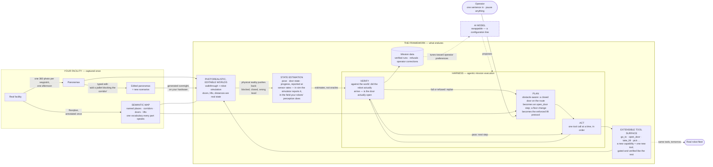

# The three-minute pitch

For a government adopter. Spoken length ≈ 3:00 with the demo running
throughout — the demo is not an interlude, it is the evidence track under the
words.

**The live demo is one thing:** a harness rollout of a single typed mission,
watched simultaneously on the dashboard (subtasks verifying), the splat
viewer (the photoreal walk) and Gazebo (the robot walking the same edges).
The panorama edit shown at 1:40 is **pre-baked** — edited and saved before
the meeting; a 40-step diffusion edit does not belong inside a three-minute
window. Numbers cited are measured on this deployment; the deep reference is
[architecture.md](architecture.md).

**The one-liner:** *A complete working reference for the framework that
endures — semantic map, harness, tool surface, editable photoreal worlds —
with every integration seam demonstrated live, on-premises. Its value is the
decisions it lets you make with evidence instead of a requirements document:
which parts to outsource (the models — replaceable by design), which to
co-source (fleet integration, one defined surface), and which to build and
own in-house (the harness, the tools, the maps, the mission data).*

---

## The diagram

One slide, referenced twice: at 1:05 (trace the plan → act → verify loop —
"the model only proposes; this loop owns correctness, and it plans around
the physics — and note it verifies against estimates, the way real sensors
report") and at 2:33 (point at the dashed arrows — "the part that ages is
outside the framework, and your data tunes its replacement").

How to read it, in one breath: the framework box is the four things that
endure. The **semantic map** — named places, corridors, doors, lifts — is
the vocabulary everything else speaks: missions are phrased in it, plans
route over it, worlds are addressed by it. The **harness** is the working
heart: a plan → act → verify loop where the *world*, not the model, says
what happened, and physical constraints are inputs the planner routes
around, not failures. The **tool surface** is how the loop touches
anything — extensible, one new function per new capability, gated and
verified like the rest, and the same surface a real fleet implements
tomorrow. The **worlds** are photorealistic, and editable by typed
instruction into any scenario. And between the worlds and VERIFY sits
**state estimation**: the loop never sees ground truth, only reports —
pose, door state, progress, arriving at sensor rates — which is exactly
the shape real-world perception has. In the field, the reporter changes
(localization and sensors instead of the simulator); the discipline of
consuming estimates does not. The model sits *outside*, on a dashed line,
because it is the part the industry improves monthly and the part you
replace in one configuration line — and your own mission data is what tunes
each replacement toward how your operators actually work.

---

## Before they walk in

- `just up`; dashboard (:8086) on the left screen, splat viewer (:8081, opened
  from the dashboard's link — it connects back on its own) on the right,
  Gazebo (:8083) in a small window under it.
- Robot standing at `lift_lobby`; splat cache warm (`splats cached 16/16 ·
  preheated 16/16` in the viewer panel — it fills itself).
- Pick a mission whose route crosses a **closed door** — `go to the apex
  lab` crosses `apex_lab_door` — so the plan visibly contains `open_door`
  before the walk begins. That one subtask is the harness beat's whole
  argument, on screen.
- Panorama editor (:8087) in a background tab, already on the waypoint whose
  edit was baked beforehand: the edit made and **saved**, so the original
  sits in `panos/.before-edit/` and the tab can toggle the two. If the
  edited waypoint's world was also regenerated overnight, keep its splat one
  click away — walking into the variant world is the strongest ten seconds
  available, but it is optional.
- Mission box empty. One typed sentence is the whole live input; everything
  else on screen is the harness rolling it out.

---

## The script

**[0:00 — stand on the dashboard]**

This building is real — it's this facility. One person walked it with a 360
camera, one photograph per waypoint, one afternoon. Everything you're about
to see was generated from those photographs overnight, on this machine, and
runs with the network cable out. Nothing — not the photos, not the model, not
the missions — ever leaves the box. And everything you're about to watch is
four things you keep, plus one part you'll replace as the industry improves.

**[0:20 — type: `go to the apex lab`, press Run. Let it move while you
talk.]**

I've given it one sentence. Watch three things move together: the agent
plans the route and writes its subtasks; the photoreal view walks the actual
corridors — that's not video, it's a generated 3D world you could grab with
the mouse; and the robot in the simulator walks the same route, edge for
edge. What keeps them together is a **semantic map** — named places,
corridors, doors, lifts — one vocabulary the mission, the plan, the worlds
and the robot all speak. On top of it sits one tool surface: `go_to`,
`open_door`, `take_lift`. It's extensible — a new capability is one new
tool, gated and verified like the rest — and it's the seam where a real
fleet plugs in tomorrow. A client written today doesn't change when the
hardware arrives.

**[1:05 — point at the subtask list; the diagram's plan → act → verify
loop is the same picture]**

Here's the heart of it — the harness. It is genuinely agentic: from that one
sentence it planned this mission itself, and look at the plan — there's an
`open_door` step *before* the corridor that needs it. The planner knows the
physics of the building: a closed door on the route becomes a door step, a
different floor can only be reached through an enforced eight-step lift
protocol. The agent doesn't discover obstacles by walking into them, and it
can't improvise around a constraint — the harness rejects out-of-order
calls. And it cannot mark its own work done: every step is verified against
the world — where the viewer stands *and* where the robot actually is,
within 0.8 of a metre — and a failed step stays open and gets replanned.
Note what "the world" means here: state *estimates*, not oracles — the
robot's pose and the door's state arrive as reports, noisy and at sensor
rates, the same shape your real robots' perception has. The tolerances and
the stall detection are built for that, so in the field you swap the
reporter, not the discipline. And that is why one small 8-billion-parameter
model, hosted on this box, runs missions safely: the model proposes, the
harness disposes. Pause it — *[click pause]* — it stops at the next action,
auditable to the line. *[resume]*

**[2:00 — switch to the panorama editor tab; toggle the pre-baked
before/after]**

The last pillar: the worlds are photorealistic *and editable*. This is a
photograph of that corridor; before the meeting we typed one instruction —
"add a pallet blocking the corridor" — and only those pixels changed, the
building held still. Regenerate that waypoint overnight and you have a
variant world: obstacles, hazards, cleared rooms. Scenario authoring for
rehearsal, without touching the real site or exposing it to anyone.

**[2:18 — back to the dashboard log]**

And every run you just watched became data. Verified trajectories, refused
calls, retries, operator pauses and corrections — structured, labelled by
outcome. Exactly the data you need to tune models toward *your* operators'
preferences, accumulating as a by-product of normal use.

**[2:33 — close, facing them, the diagram back on screen]**

The models will keep improving — monthly, and not by us. That's the design
bet: here the model is one configuration line. What endures is everything
you just watched — these four things. The **harness**, which plans around
physics and lets the world say what happened. The **tool surface**, where a
new capability is one new tool and any model can call it. The **semantic
map**, the vocabulary of places and doors and lifts that every mission
speaks. And **photoreal worlds of your own facilities**, editable by typed
instruction into any scenario. Drop next year's model in and all four keep
working — tuned, by then, on your own operators' data. One afternoon of
capture per floor, one night of GPU, and it's yours — on your premises,
under your control.

---

## If they ask

- **"What does it cost to add a building?"** — An afternoon with a 360
  camera, ~20 GPU-minutes per waypoint overnight, an hour of aligning and
  marking. No specialists on site.
- **"Is the imagery shared with a model provider?"** — Nothing leaves the
  machine at any stage; the weights are fetched once and it runs air-gapped.
- **"How real is the 3D?"** — Generated from one photo per waypoint:
  photoreal at the places that were photographed, honest about being
  generative in between — and the pipeline scores every world and shows you
  side-by-sides before you trust it.
- **"Can it drive our actual robots?"** — The robot side already speaks
  RMF's vocabulary (waypoints, doors, lifts); the bridge is one HTTP surface
  a fleet adapter shim can implement.
- **"Can we add our own capabilities?"** — A new capability is one new tool
  function: registered with a decorator, it inherits the same gates
  (ordering, pause, cancel) and gets its own verifier — and every model,
  current or future, can call it immediately. `pick`/`place` are exactly
  such additions.
- **"How close is the sim's state to real perception?"** — Deliberately the
  same shape. Pose arrives as periodic reports (~1.5 Hz here), commands
  return before the motion completes, doors report their own state — so the
  harness already verifies with tolerances (0.8 m), detects a stalled robot
  by observed stillness rather than by trusting a dispatch, and treats every
  reading as an estimate. Moving to the field replaces the reporter —
  localization and sensors instead of the simulator — not the discipline,
  which has been rehearsed on every mission run in sim.
- **"What decision does this actually help us make?"** — Sourcing. Each
  pillar is an integration seam with a working interface behind it, so the
  lines can be drawn on evidence: the **models** are procurable and
  replaceable — outsource them, re-compete them as the industry moves; the
  **fleet integration** is one defined HTTP surface — co-source it with a
  robot vendor; the **harness, tool surface, semantic maps and mission
  data** are small, auditable, and the parts worth owning — in-house.
  Capture and scenario authoring sit with your own operators: one person,
  one afternoon, no specialists.
- **"Why not wait for the industry to ship this?"** — Waiting buys a better
  model, and this framework will run it the day it ships. It won't buy your
  buildings captured, your operators' data accumulated, or a harness your
  auditors have already read.
