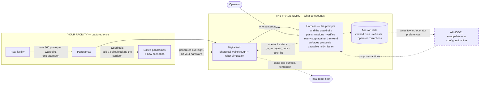

# The three-minute pitch

For a government adopter. Spoken length ≈ 3:00 with the demo running
throughout — the demo is not an interlude, it is the evidence track under the
words.

**The live demo is one thing:** a harness rollout of a single typed mission,
watched simultaneously on the dashboard (subtasks verifying), the splat
viewer (the photoreal walk) and Gazebo (the robot walking the same edges).
The panorama edit shown at 1:40 is **pre-baked** — edited and saved before
the meeting; a 40-step diffusion edit does not belong inside a three-minute
window. Numbers cited are measured on this deployment; the deep reference is
[architecture.md](architecture.md).

**The one-liner:** *One person photographs a facility in an afternoon; by
morning it is a walkable digital twin an AI agent can be trusted to operate
in — entirely on your own hardware, and the AI is the replaceable part.*

---

## The diagram

One slide, referenced twice: at 1:05 (point at the harness box — "the model
only proposes; this box owns correctness") and at 2:25 (point at the dashed
arrows — "the part that ages is outside the framework, and your data tunes
its replacement").

How to read it, in one breath: everything inside the framework box is yours
and durable — the captured buildings, the editable scenarios, the verified
tool surface, the accumulating operator data. The model sits *outside*, on a
dashed line, because it is the part the industry improves monthly and the
part you replace in one configuration line — and your own mission data is
what tunes each replacement toward how your operators actually work.

---

## Before they walk in

- `just up`; dashboard (:8086) on the left screen, splat viewer (:8081, opened
  from the dashboard's link so `?agent=` is set) on the right, Gazebo (:8083)
  in a small window under it.
- Robot standing at `lift_lobby`; splat cache warm (`splats cached 16/16 ·
  preheated 16/16` in the viewer panel — it fills itself).
- Panorama editor (:8087) in a background tab, already on the waypoint whose
  edit was baked beforehand: the edit made and **saved**, so the original
  sits in `panos/.before-edit/` and the tab can toggle the two. If the
  edited waypoint's world was also regenerated overnight, keep its splat one
  click away — walking into the variant world is the strongest ten seconds
  available, but it is optional.
- Mission box empty. One typed sentence is the whole live input; everything
  else on screen is the harness rolling it out.

---

## The script

**[0:00 — stand on the dashboard]**

This building is real — it's this facility. One person walked it with a 360
camera, one photograph per waypoint, one afternoon. Everything you're about
to see was generated from those photographs overnight, on this machine, and
runs with the network cable out. Nothing — not the photos, not the model, not
the missions — ever leaves the box.

**[0:20 — type: `go to the apex lab`, press Run. Let it move while you
talk.]**

I've given it one sentence. Watch three things move together: the agent
plans the route and writes its subtasks; the photoreal view walks the actual
corridors — that's not video, it's a generated 3D world you could grab with
the mouse; and the robot in the simulator walks the same route, edge for
edge. One nav graph, one tool surface — `go_to`, `open_door`, `take_lift` —
drives all of it. The same API that drives this simulated robot is the seam
where a real fleet plugs in. A client written today doesn't change when the
hardware arrives.

**[1:05 — point at a subtask ticking to ✓]**

Here's the part that matters for trust. The AI cannot mark its own work
done. Every subtask is verified against the world — where the viewer stands
*and* where the robot's state says it is, within 0.8 of a metre — before the
harness, not the model, ticks it. Out-of-order calls are rejected. Lifts can
only be taken through an enforced eight-step protocol. That's why this runs
safely on a small 8-billion-parameter model hosted on this box: the harness
owns correctness, the model only proposes. Pause it — *[click pause]* — and
it stops at the next action, auditable to the line.

**[1:40 — switch to the panorama editor tab; toggle the pre-baked
before/after]**

The twin is also editable. This is a photograph of that corridor. Before the
meeting we typed one instruction — "add a pallet blocking the corridor" —
and here is the result: only those pixels changed, the building held still.
Regenerate that one waypoint overnight and you have a variant world:
obstacles, hazards, cleared rooms. Scenario authoring for rehearsal and
training, without touching the real site or exposing it to anyone.

**[2:05 — back to the dashboard log]**

And every run you just watched became data. Verified trajectories, refused
calls, retries, the moments an operator paused or corrected by hand — all
structured, all labelled by outcome. That is exactly the data you need to
tune models toward *your* operators' preferences, and it accumulates as a
by-product of normal use.

**[2:25 — close, facing them]**

The models will keep improving — monthly, and not by us. That's the design
bet: here the model is a configuration line. Swap in next year's model and
everything you own keeps working — the capture pipeline, the twins of your
buildings, the verified tool surface, the safety harness, the accumulated
operator data. The value that compounds is the framework and your data;
the part that ages is the part you can replace in one line. One afternoon of
capture per floor, one night of GPU, and it's yours — on your premises,
under your control.

---

## If they ask

- **"What does it cost to add a building?"** — An afternoon with a 360
  camera, ~20 GPU-minutes per waypoint overnight, an hour of aligning and
  marking. No specialists on site.
- **"Is the imagery shared with a model provider?"** — Nothing leaves the
  machine at any stage; the weights are fetched once and it runs air-gapped.
- **"How real is the 3D?"** — Generated from one photo per waypoint:
  photoreal at the places that were photographed, honest about being
  generative in between — and the pipeline scores every world and shows you
  side-by-sides before you trust it.
- **"Can it drive our actual robots?"** — The robot side already speaks
  RMF's vocabulary (waypoints, doors, lifts); the bridge is one HTTP surface
  a fleet adapter shim can implement.
- **"Why not wait for the industry to ship this?"** — Waiting buys a better
  model, and this framework will run it the day it ships. It won't buy your
  buildings captured, your operators' data accumulated, or a harness your
  auditors have already read.
